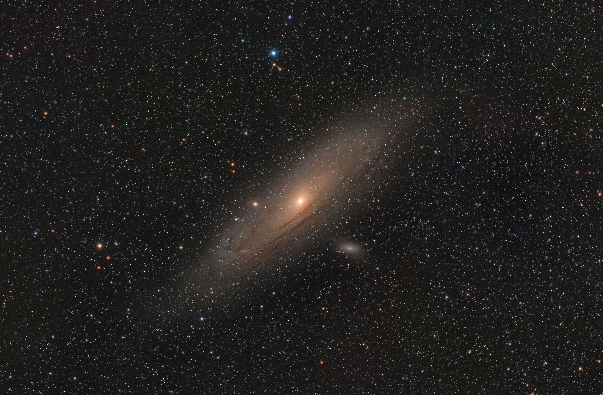
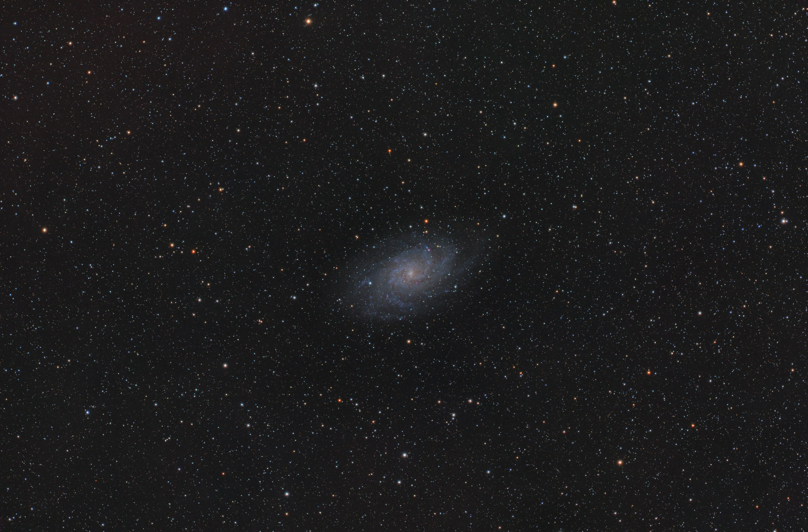
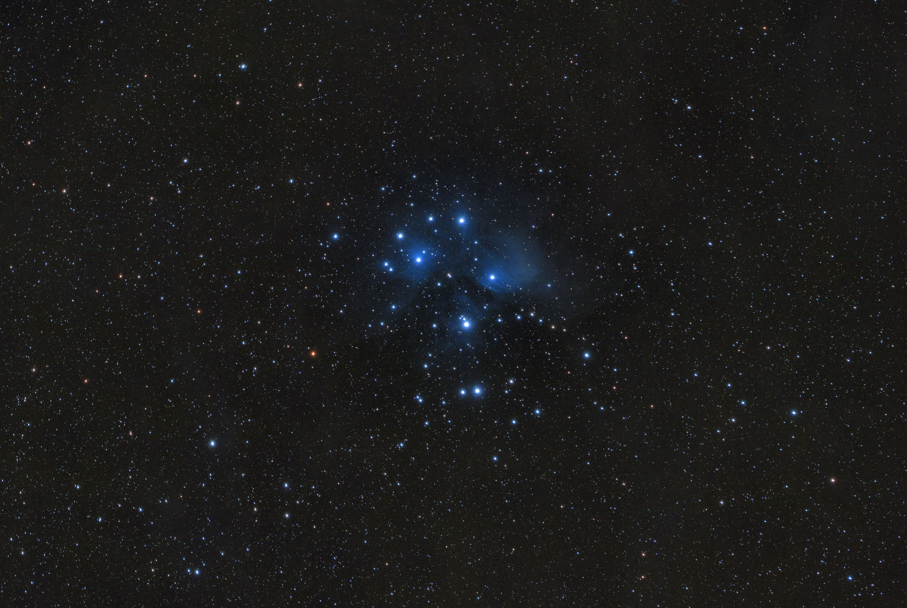
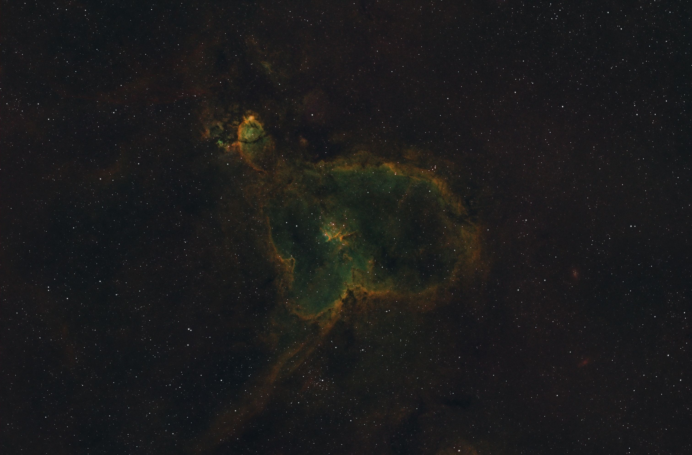

# autoSiril

Automation tools for astrophotography image processing.

## Sample Output

<p align="center">
  <a href="images/M31.jpg"></a>
  <a href="images/M33.jpg"></a>
</p>
<p align="center">
  <a href="images/M45.jpg"></a>
  <a href="images/SH2-190.jpg"></a>
</p>

## Projects

### Siril Job Runner

Automated Siril processing pipeline with JSON job file configuration.

```bash
# Run a single job
uv run python run_job.py jobs/M42.json

# Run multiple jobs
uv run python run_job.py jobs/M42.json jobs/M31.json

# Run all jobs in a directory
uv run python run_job.py jobs/

# Run jobs matching a pattern
uv run python run_job.py jobs/ --pattern "SH2*"

# Continue processing after failures
uv run python run_job.py jobs/ --continue-on-error
```

Features:
- Job file-based configuration for reproducible processing
- Auto-detection of calibration requirements from FITS headers
- Temperature tolerance matching for darks/bias
- Multi-night light frame support
- Support for LRGB, SHO, and HOO workflows
- VeraLux processing steps: Stretch, Silentium (noise), Revela (detail), Vectra (saturation), StarComposer

See [siril_job_runner/README.md](siril_job_runner/README.md) for full documentation.

### XISF to FITS Converter

Batch convert XISF files to FITS format.

```bash
# Convert all XISF files, excluding processed folders
uv run python -m xisf_to_fits /path/to/images -e process
```

Features:
- Recursive directory scanning
- Exclude patterns for processed/calibration folders
- Progress bar with ETA
- Verification of converted files

See [xisf_to_fits/README.md](xisf_to_fits/README.md) for full documentation.

## Installation

Requires [uv](https://docs.astral.sh/uv/) for dependency management.

```bash
git clone https://github.com/yourusername/autoSiril.git
cd autoSiril
uv sync
```

## Development

```bash
# Run tests
uv run pytest

# Run tests with coverage
uv run pytest --cov
```
